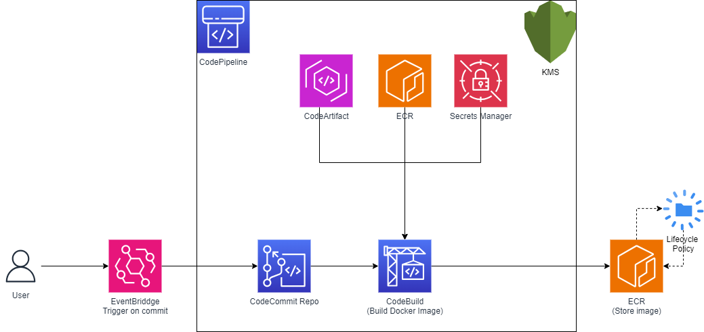

# Introduction

This projects aims at helping Yellow Pages to migrate their repositories and their Continuous Integration from Bitbucket + droneCI to a 100% AWS infrastructure.

The current challenges with the existing solution are as follow : 
- The differents components are located in 3 differents places : 
  - BitBucket for the repository
  - Google Cloud to store docker images
  - AWS where the kubernetes clusters are running


# Architecture

## Overall

## CodePipeline


## Buildspec.yml file


# Deploy infrastructure 

#### Prerequisites
- An AWS account that have admin-like rights
- aws cli configured (i.e. credentials setup)
- terraform cli (check version.tf file to see which version to configure)

#### Commands
```bash
#See to check changes that will be made to infrastructure  
terraform plan  --var-file vars.tfvars --var-file envs/<project_name>/vars.tfvars  
#Apply changes if it seems ok to you 
terraform apply  --var-file vars.tfvars --var-file envs/<project_name>/vars.tfvars  
```

# Macro procedure regarding migration
The easiest way to do the migration is to migrate each project (such as SCAF, BIL, STORE) one by one.
This means that you might migrate all repositories from project before going to the following.

## Procedure for each repo
## Diagram 


## Procedure

- Set end date for all local changes to be commited 
- Once all changes are committed
  - Deploy Terraform infra 
  - Deploy Artifacts if needed (docker images, npm packages)
  - Migrate code from BitBucket to CodeCommit (see below)
- Then all devs are able to clone the CodeCommit repo and work from there

# Components explained
## Git Repository
### Diagram

### How to migrate repository 
In order to use the whole AWS ecosystem for our CI, we'll be using CodeCommit to store our code...

### Transfer from BitBucket to CodeCommit
#### Prerequisites
- An AWS account that allows access to CodeCommit 
- aws cli configured (i.e. credentials setup)
- git cli
#### Commands 
```bash
#AWS Util
pip install git-remote-codecommit
#Clone repo with history from BitBucket
git clone --mirror <url_of_old_repo>
cd <name_of_old_repo>
#Change origin to CodeCommit repo
git remote add new-origin <url_of_new_repo>
#Push with all history to CodeCommit repo
git push new-origin --mirror
```

### How to start working on CodeCommit Repo
#### Prerequisites
- An AWS account that allows access to CodeCommit 
- aws cli configured (i.e. credentials setup)
- git cli
#### Commands
```bash
#AWS Util
pip install git-remote-codecommit
#Clone repo with history from BitBucket
git clone codecommit::us-east-1://<repo-name>
```

## Docker Repository

The current solution uses Google Cloud Repository (GCR), which is not ideal in our case as we'd need to implement authorization to Google Cloud, configure network, etc.
Fortunately AWS offers a solution to store our images, named Elastic Container Registery (ECR). 
After configuring docker to point to our ECR registery, you can use the docker cli as usual

### Which images should you publish ? 
From the use case of YP, the docker images that should be manually migrated are the public ones used currently, this include : 
- node:fermium
- sonar 
- yphelm (maybe)

The other images, based on YP code (i.e. simple-scaffold-service, etc), will be automatically published during te CI process 

### How to publish to an ecr registery
#### Prerequisites
- An AWS account that allows access to ECR Registery + 
- aws cli configured (i.e. credentials setup)
- docker cli

#### Commands
```bash
# Login to ecr
aws ecr get-login-password --region region | docker login --username AWS --password-stdin <aws_account_id>.dkr.ecr.<region>.amazonaws.com
# Download for public docker registery
docker pull <public_docker_image>
# List your local images
docker images
# Tag our image to 
docker tag <image_id> <aws_account_id>.dkr.ecr.<region>.amazonaws.com/<repo_name>:<tag>
# Push image to ecr
docker push <aws_account_id>.dkr.ecr.<region>.amazonaws.com/<repo_name>:<tag>
```

## NPM Packages 

The current solution to store artifact is Verdaccio, an open source project. 
In order to migrate to an AWS solution, the service used is CodeArtifact
CodeArtifact is a fully managed artifact repository service that makes it easy for organizations of any size to securely store, publish, and share software packages used in their software development process.

In the YP context, it will be used with npm packages.

### Diagram


The CodeArtifact domain allows to store differents repositories, that would be used by the same project. 
We can see 2 repos : 
- npm-ypcloud 
  - stores the ypcloud specific packages such as yp-swagger, yp-logger etc
- npm-public :
  - Act as a mirror of the public npm registery, it caches packages once downloaded once (initiated by 1st npm install)
  - Is an upstram repository of npm-ypcloud, meaning that if an package is not found in npm-ypcloud, it searches here

### How to migrate npm packages
#### Prerequisites

- An AWS account that allows access to CodeArtifact Domain/Repos + 
- aws cli configured (i.e. credentials setup)
- npm cli
- git cli

#### Instructions
##### Download
```bash
git clone <package_repo_url>
```

##### Edit package.json file
###### Regarding the **scripts** part, include those 2 lines : 
```json
  "scripts": {
    "prepare": "npm run co:login",
    <...>
    "co:login": "aws codeartifact login --tool npm --repository <repo_name> --domain <domain_name>"
  },
```
###### At **publishConfig**, changer registery adress to CodeArtifact one 
```json
  "publishConfig": {
    "registry": "https://<domain_name>-<owner_account_id>.d.codeartifact.<region>.amazonaws.com/npm/<repo_name>/"
  }
```

###### Run following command : 
```bash
npm publish 
#If there is no error code, it means your ackage was successfully published to private package repository
```

# Features to add in the future

- sonar step 
- deploy step 
- configure remote tfstate 
- check docker images tag logic 

- create IAM role for users (Admin + Readonly)
- add cache on node_modules


WHAT WOULD BE NICE :

- terraform local-exec script that allows to transfer automatically repo from BB to CodeCommit


<!-- BEGIN_TF_DOCS -->
## Requirements

| Name | Version |
|------|---------|
| <a name="requirement_terraform"></a> [terraform](#requirement\_terraform) | >= 1.2.0 |
| <a name="requirement_aws"></a> [aws](#requirement\_aws) | 5.13.1 |

## Providers

| Name | Version |
|------|---------|
| <a name="provider_aws"></a> [aws](#provider\_aws) | 5.13.1 |

## Modules

| Name | Source | Version |
|------|--------|---------|
| <a name="module_network"></a> [network](#module\_network) | ./modules/network | n/a |
| <a name="module_repository"></a> [repository](#module\_repository) | ./modules/stack | n/a |

## Resources

| Name | Type |
|------|------|
| [aws_codeartifact_domain.yp](https://registry.terraform.io/providers/hashicorp/aws/5.13.1/docs/resources/codeartifact_domain) | resource |
| [aws_codeartifact_repository.node_repo](https://registry.terraform.io/providers/hashicorp/aws/5.13.1/docs/resources/codeartifact_repository) | resource |
| [aws_codeartifact_repository.yp_repo](https://registry.terraform.io/providers/hashicorp/aws/5.13.1/docs/resources/codeartifact_repository) | resource |
| [aws_kms_alias.cmk_key_alias](https://registry.terraform.io/providers/hashicorp/aws/5.13.1/docs/resources/kms_alias) | resource |
| [aws_kms_key.cmk_key](https://registry.terraform.io/providers/hashicorp/aws/5.13.1/docs/resources/kms_key) | resource |
| [aws_kms_key_policy.key_policy](https://registry.terraform.io/providers/hashicorp/aws/5.13.1/docs/resources/kms_key_policy) | resource |
| [aws_s3_bucket.artifacts_bucket](https://registry.terraform.io/providers/hashicorp/aws/5.13.1/docs/resources/s3_bucket) | resource |
| [aws_s3_bucket_acl.artifacts_bucket](https://registry.terraform.io/providers/hashicorp/aws/5.13.1/docs/resources/s3_bucket_acl) | resource |
| [aws_s3_bucket_ownership_controls.artifacts_bucket](https://registry.terraform.io/providers/hashicorp/aws/5.13.1/docs/resources/s3_bucket_ownership_controls) | resource |
| [aws_secretsmanager_secret.project_secrets](https://registry.terraform.io/providers/hashicorp/aws/5.13.1/docs/resources/secretsmanager_secret) | resource |
| [aws_caller_identity.current](https://registry.terraform.io/providers/hashicorp/aws/5.13.1/docs/data-sources/caller_identity) | data source |
| [aws_iam_policy_document.key_policy_doc](https://registry.terraform.io/providers/hashicorp/aws/5.13.1/docs/data-sources/iam_policy_document) | data source |
| [aws_region.current](https://registry.terraform.io/providers/hashicorp/aws/5.13.1/docs/data-sources/region) | data source |

## Inputs

| Name | Description | Type | Default | Required |
|------|-------------|------|---------|:--------:|
| <a name="input_azs"></a> [azs](#input\_azs) | n/a | `list(string)` | <pre>[<br>  "us-east-1a",<br>  "us-east-1b",<br>  "us-east-1c"<br>]</pre> | no |
| <a name="input_ci_secrets_name"></a> [ci\_secrets\_name](#input\_ci\_secrets\_name) | n/a | `list(string)` | n/a | yes |
| <a name="input_codeartifact_domain_name"></a> [codeartifact\_domain\_name](#input\_codeartifact\_domain\_name) | n/a | `string` | n/a | yes |
| <a name="input_codeartifact_repo_name"></a> [codeartifact\_repo\_name](#input\_codeartifact\_repo\_name) | n/a | `string` | n/a | yes |
| <a name="input_codeartifact_repositories"></a> [codeartifact\_repositories](#input\_codeartifact\_repositories) | n/a | `list(string)` | n/a | yes |
| <a name="input_env"></a> [env](#input\_env) | n/a | `string` | n/a | yes |
| <a name="input_macro_project_name"></a> [macro\_project\_name](#input\_macro\_project\_name) | n/a | `string` | n/a | yes |
| <a name="input_private_subnet_cidrs"></a> [private\_subnet\_cidrs](#input\_private\_subnet\_cidrs) | n/a | `list(string)` | <pre>[<br>  "10.0.1.0/24",<br>  "10.0.2.0/24",<br>  "10.0.3.0/24"<br>]</pre> | no |
| <a name="input_project_name"></a> [project\_name](#input\_project\_name) | n/a | `string` | n/a | yes |
| <a name="input_public_subnet_cidrs"></a> [public\_subnet\_cidrs](#input\_public\_subnet\_cidrs) | n/a | `list(string)` | <pre>[<br>  "10.0.4.0/24",<br>  "10.0.5.0/24",<br>  "10.0.6.0/24"<br>]</pre> | no |
| <a name="input_region"></a> [region](#input\_region) | n/a | `string` | n/a | yes |
| <a name="input_repository_names"></a> [repository\_names](#input\_repository\_names) | n/a | `list(string)` | n/a | yes |
| <a name="input_vpc_cidr"></a> [vpc\_cidr](#input\_vpc\_cidr) | n/a | `string` | `"10.0.0.0/16"` | no |

## Outputs

No outputs.
<!-- END_TF_DOCS -->